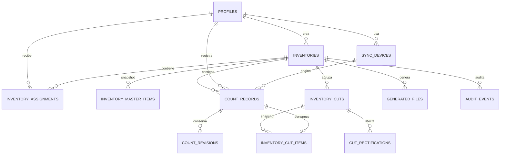

# Modelo de datos v1 — Fase 1

La migración inicial usa UUID, `timestamptz` (UTC), claves foráneas restrictivas, índices de acceso y constraints para invariantes inequívocas. Los identificadores operacionales se almacenan como `text` para preservar ceros iniciales.

## Relaciones e invariantes

- `profiles.user_id` referencia `auth.users`; el rol vive en tabla protegida, no en metadata editable por cliente.
- `inventory_assignments` y `inventory_master_items` son únicos por `(inventory_id, user_id)` y `(inventory_id, codigo)` respectivamente.
- `count_records.client_count_id` es único globalmente; es la base de idempotencia futura. `received_at` es `not null default now()` y sólo representa recepción server-side; un futuro RPC nunca lo aceptará del cliente. La FK compuesta `(inventory_id, codigo)` exige un SKU maestro del mismo inventario y `(device_id, user_id)` exige que el dispositivo pertenezca al contador.
- `cut_id` y `export_seq` son ambos nulos o ambos presentes; la secuencia es única por inventario. Las FK compuestas impiden cortes, snapshots, rectificaciones y archivos que crucen inventarios.
- `inventory_cut_items.count_record_id` es único: un conteo entra en cero o un corte, nunca en dos. El futuro RPC de corte actualizará `count_records.cut_id` y el snapshot en una transacción.
- Revisiones, rectificaciones y auditoría son append-only para roles operacionales: no existen políticas `UPDATE` o `DELETE` para alterarlas.
- `inventory_freeze_guards` conserva pendientes conocidos por dispositivo. `freeze_inventory` bloquea solo ante señales conocidas; la sincronización futura será responsable de publicar y resolver esas señales.
- Fase 2 agrega `inventory_master_metadata` por inventario (`master_version`, `row_count`, `fingerprint`, `cached_at`) e `inventory_master_exceptions` append-only. La metadata usa SHA-256 determinista del snapshot ordenado; una importación o excepción incrementa la versión.
- Las relaciones de maestro siguen siendo restrictivas. El reemplazo físico de filas existe sólo dentro de `import_inventory_master`, antes de ABIERTO y dentro de su transacción; el cliente nunca recibe privilegio de escritura directa.
- Fase 4 añade a `count_records` `inventory_status_at_receive` y `captured_after_closed_at`. `received_at` sigue siendo generado por PostgreSQL; en `CERRADO` se conserva explícitamente el estado de recepción y si la captura fue posterior al cierre. `CONGELADO` no inserta nuevos registros.
- `sync_devices.id` es un UUID opaco por usuario/instalación, no un identificador físico. La propiedad no puede cambiar: un ID existente de otro usuario es rechazado. `inventory_freeze_guards` se actualiza por RPC con el total conocido de pendientes y se resuelve al informar cero.
- Fase 5 no agrega tablas operacionales ni duplica telemetría. Los modelos de supervisión se derivan de `count_records.received_at`, `cantidad_contada`, `inventory_assignments`, `sync_devices.last_seen_at`/`last_sync_at` e `inventory_freeze_guards`. Los índices de lectura se limitan a `inventory_id` más la ordenación `(captured_at DESC, id DESC)` y filtros de código, serie, partida y ubicación.
- Una serie repetida se deriva como agrupación de observaciones recibidas sobre un SKU `SERIAL`; no existe constraint único ni estado de rechazo de Fase 5. Las partidas siguen siendo repetibles por diseño.
- La corrección de Fase 5 añade `app_private.inventory_device_activity`, fuera del esquema Data API, con clave `(inventory_id, device_id)`, usuario propietario, últimas observaciones inventory-scoped y pendientes conocidos. Tiene FK compuesta a `sync_devices`, RLS habilitada, ningún grant cliente y no sustituye los datos globales de `sync_devices`.
